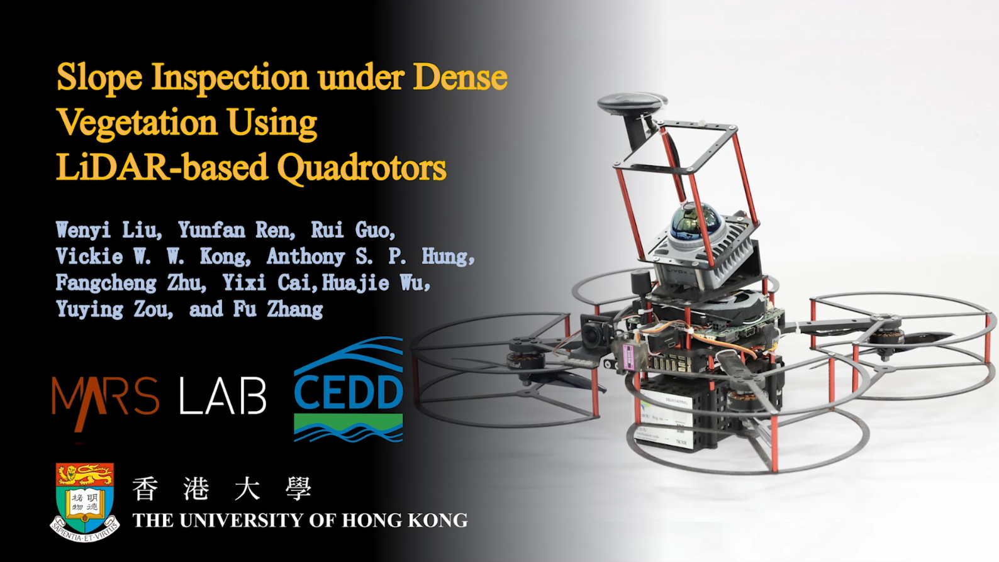

# *[Natrue Communications]* Slope inspection under dense vegetation using LiDAR-based quadrotors

## Overview

Author: [Wenyi Liu](https://github.com/FENYUN323), [Yunfan Ren](https://github.com/RENyunfan) and [Fu Zhang](https://www.mech.hku.hk/academic-staff/Zhang-F) from [HKU MARS Lab](https://mars.hku.hk/).

Paper: [Natrue Communications](https://www.nature.com/articles/s41467-025-62801-y)

Code: [Github](https://github.com/hku-mars/IPC)

Video Links: [youtube](https://www.youtube.com/watch?v=x8UHqSNi7kg), [Bilibili](https://www.bilibili.com/video/BV1P7e3zgEaa)

Click for the video demo.

[](https://www.youtube.com/watch?v=x8UHqSNi7kg)

If our repository supports your academic projects, please cite our work. Thank you!

```
@article{liu2025slope,
  title={Slope inspection under dense vegetation using LiDAR-based quadrotors},
  author={Liu, Wenyi and Ren, Yunfan and Guo, Rui and Kong, Vickie WW and Hung, Anthony SP and Zhu, Fangcheng and Cai, Yixi and Wu, Huajie and Zou, Yuying and Zhang, Fu},
  journal={Nature Communications},
  volume={16},
  number={1},
  pages={7411},
  year={2025},
  publisher={Nature Publishing Group UK London}
}
```

## 1. About this work

Landslides pose significant threats to residents' safety and daily lives. To mitigate such risks, flexible debris-resisting barriers are constructed and regularly inspected, a task known as slope inspection. Traditional manual inspections are costly and difficult due to steep terrains and dense vegetation. Unmanned aerial vehicle (UAV) equipped with LiDAR and cameras offers high mobility, making them well-suited for slope inspections. However, existing UAV solutions lack comprehensive frameworks to handle dense vegetation, including robust localization, high-precision mapping, small and dynamic obstacle avoidance, and cluttered under-canopy navigation. To address these challenges, we develop a LiDAR-based quadrotor with a comprehensive software system. Our quadrotor features assisted obstacle avoidance, enabling it to autonomously avoid intricate obstacles while executing pilot commands. Field experiments conducted in collaboration with the Hong Kong Civil Engineering and Development Department demonstrate our quadrotor's ability to avoid small obstacles and maneuver in dense vegetation, validating its practical potential for slope inspection.

## 2. Prerequisited

### 2.1 Ubuntu and ROS

Ubuntu 18.04~20.04, [ROS Installation](http://wiki.ros.org/ROS/Installation)

### 2.2 PCL and Eigen

PCL >= 1.6, follow [PCL Installation](https://pointclouds.org)

Eigen >= 3.3.4, follow [Eigen Installation](https://eigen.tuxfamily.org/index.php?title=Main_Page)

glfw3: 

```
sudo apt-get install libglfw3-dev libglew-dev
```

### 2.3 OSQP and OSQP-Eigen

Select the version below v0.6.3

* [osqp-github](https://github.com/osqp/osqp)
* [osqp-document](https://osqp.org/docs/get_started/sources.html)
* [osqp-releases(below v0.6.3)](https://github.com/osqp/osqp/releases/tag/v0.6.3)
* [qdldl-releases(below v0.1.7)](https://github.com/osqp/qdldl/releases/tag/v0.1.7)

Install OSQP
```
git clone --recursive https://github.com/osqp/osqp
cd osqp
mkdir build
cd build
cmake ..
sudo make install
```

* [osqp-eigen-github](https://github.com/robotology/osqp-eigen)

Install OSQP-Eigen
```
git clone https://github.com/robotology/osqp-eigen.git
cd osqp-eigen
mkdir build
cd build
cmake ..
sudo make
sudo make install
```

### 2.4 serial

```bash
sudo apt-get install ros-noetic-serial
```

### 2.5 fmt

```bash
sudo apt-get install ros-noetic-rosfmt -y
```

### 2.6 joy

```bash
sudo apt-get install ros-noetic-joy
```

### 2.7 Other

A debug tool: *backward.cpp*

Installation
```
sudo apt-get install libdw-dev
wget https://raw.githubusercontent.com/bombela/backward-cpp/master/backward.hpp
sudo mv backward.hpp /usr/include
```

## 3 Make

```
mkdir -p slope_ws
cd slope_ws
git clone https://github.com/hku-mars/IPC.git
sudo mv slope_inspection src
catkin_make -DCATKIN_WHITELIST_PACKAGES="mars_base"
catkin_make -DCATKIN_WHITELIST_PACKAGES=
```

## 4 Run and test

### (1) run MARSIM simulator

```
source devel/setup.bash
roslaunch test_interface map_faster.launch
```

### (2) run ipc

```
source devel/setup.bash
roslaunch test_interface ipc_sim.launch
```

### (3) run rc

option 1: PX4 flight controller + receiver + remote controller

```
roslauch mavros px4.launch
```

option 2: joystick

```
roslaunch joy_rc BT_x1.launch
```

option 3: sbus to USB module + receiver + remote controller

```
rosrun joy_rc subs_rc_node
```

purchase: [sbus to USB module](https://item.taobao.com/item.htm?abbucket=1&id=945065337900&mi_id=0000JQFMzlhQngPHR4jHpETaA99nRWDuC-3gm7bBXLxKOIE&ns=1&priceTId=2147828517556989550222799e1257&skuId=5847858524751&spm=a21n57.1.hoverItem.4&utparam=%7B%22aplus_abtest%22%3A%222437657e83ff0381d7c73c86414814f0%22%7D&xxc=taobaoSearch)


